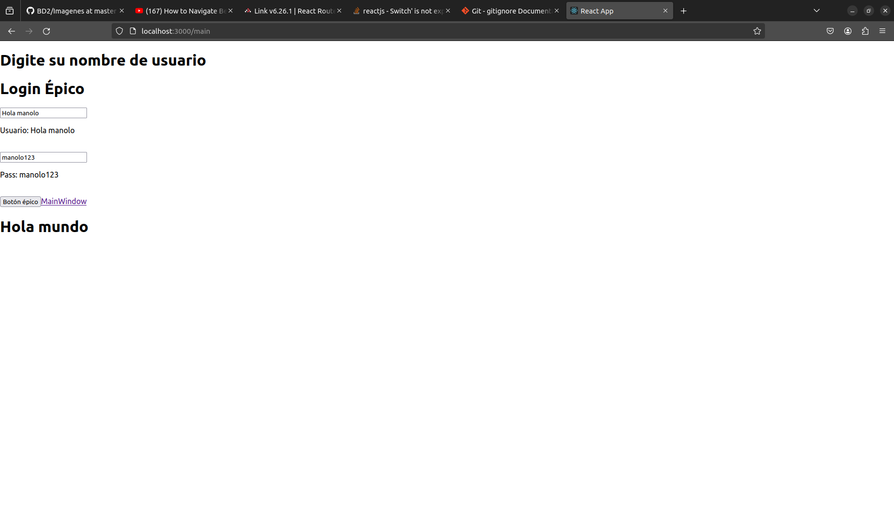

# BD2 proyecto 1
Esto es un repositorio

## Seccion para saludar 
Buenas, esta sección del readme es para saludar y la siguiente es para decir cosas

Quiero mandar un saludo a todas aquellas personas que me han apoyado. Gracias.

## Seccion para decir cosas
Revisen [Tutorial](tutoriales.md), esto es una vara que estaba siguiendo, para que la revisen
### Login
Alguno haga esta parte del login,hice un componente separado para que ahí se trabaje, básicamente hay que hacerlo que sea bonito y luego que acceda a la base de datos, revise que se encuentra la persona registrada y devolver la información o mando un error.

