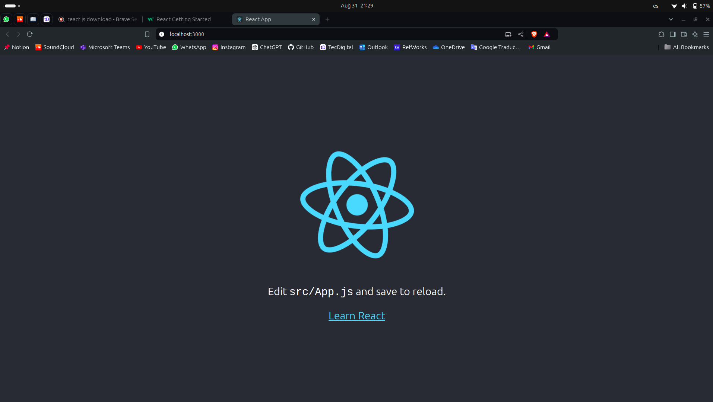
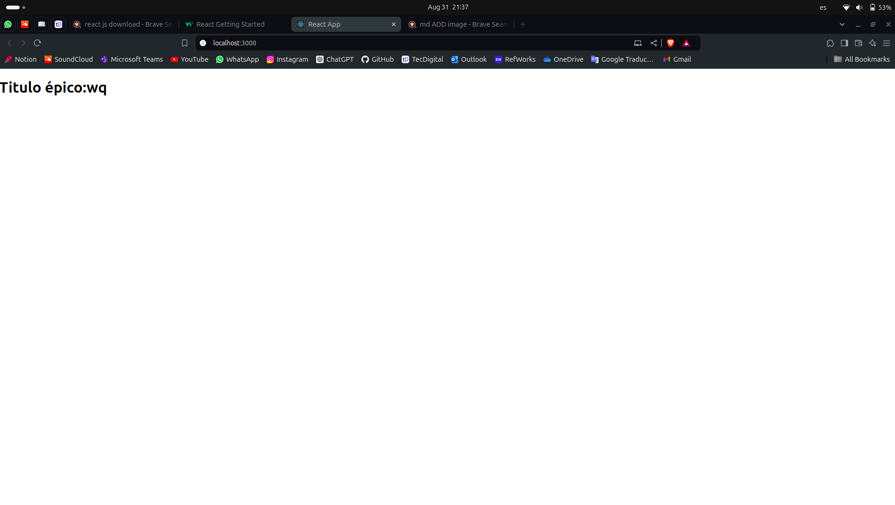
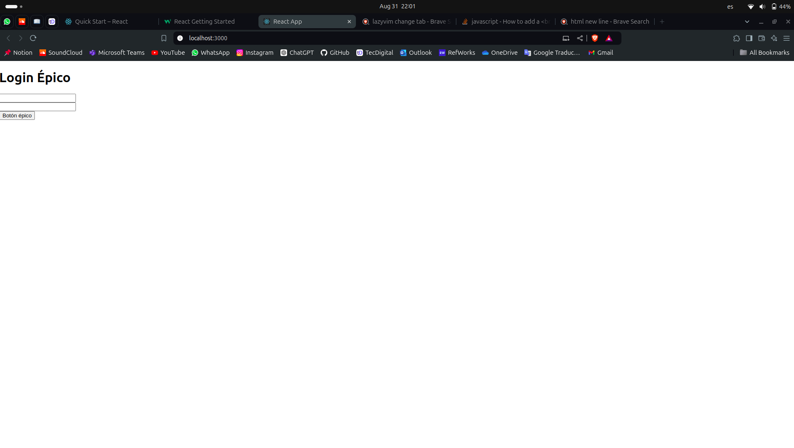

# Tutoriales

Buenas esto es un archivo 
En este archivo hay letras, palabras y otras cosas 
Entre esas cosas voy a poner los links de tutoriales y cosas que parezcan utiles

## React 

### Links

[Quick Start React official tutorial](https://react.dev/learn) \
[Geeks for Geeks React Quick start](https://www.w3schools.com/react/react_getstarted.asp)

### Algo no sé

Corrí en la carpeta del proyecto el siguiente comando para crear la aplicación de react:

> npx create-react-app proyecto1

Luego de que se instalaran los paquetes corrí la aplicación y salió algo:

> cd proyecto1 \
> npm start 

Luego cambié el div por un h1 dentro del archivo /proyecto1/src/App.js; al guardarlo la página cambió automáticamente

Luego de Luego de Luego de eso hice un archivo "pruebas.js" en el folder "proyecto1/src" 
En ese archivo puse unas funciones (componentes): Button() y TextField()
Luego las importé a App.js y las usé para crear un logín simple
Muy probablemente no es así como se debería hacer, pero por lo menos logré crear una "interfaz" sin usar html

---

# Nota
Si algo les da error por alguna dependencia ejecuten de nuevo 
~~~
npm install
~~~
Agregué una dependencia nueva que es para cambiar de páginas o algo así, si les falla algo tratan de instalar esa es:
~~~
npm install react-router-dom
~~~
[Información sobre react-router](https://reactrouter.com/en/main/components/link)

# Tutorial git

* Para hacer pull: git pull (nombre repositorio local) (nombre repositorio remoto) 
* Para agragar cambios: git add -A 
* Para commit: git commit -m "mensaje"
* Para push: git push (nombre repo local) (ramaLocal):(ramaRemota)

# Guía CouchDB
Intenté instalarlo con sudo apt pero es muy complicado y me dio errores, recomiendo usar snap
~~~
$ sudo snap install couchdb
~~~

Generar una cookie aleatoria
~~~
$ mcookie
~~~
Crear un admin, sin el admin no pueden interactuar con la base de datos. Ingresan la cookie de antes y la contraseña que quieran y reinician para guardar cambios
~~~
$ sudo snap set couchdb admin=your-password setcookie=[your-cookie]
$ sudo snap restart couchdb
~~~
Ahora en el proyecto de NodeJS instalar nano
~~~
$ npm install nano
~~~
Para visualizar la base de datos abrir en su navegador: 127.0.0.1:5984/_utils 

Ahí se loguean con el usuario admin y la contraseña, pueden ver y borrar los archivos

Si no les funciona corran el comando:
~~~
$ sudo snap start couchdb
~~~

Importante antes de probar el código crear una base de datos, lo pueden hacer con Node o desde el navegador.
También en backend/src/controlles/repositories.controller.js está la conexión, ahí puse unos comentarios de dónde va el nombre de la base de datos, el nombre de usuario y la contraseña que uds pusieron
